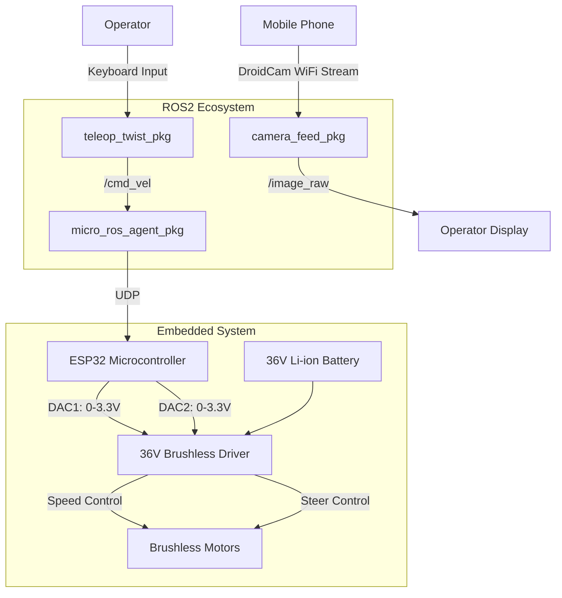

# ROS2 Micro-ROS Robot Control System

## Complete System Architecture



A ROS2-based project to control a robot via WiFi using Micro-ROS, featuring:
- Twist command input from keyboard
- Visual feedback via DroidCam smartphone camera
- ESP32-based motor control with brushless bi-motor driver


## Features
- 📷 Real-time camera streaming using DroidCam
- ⌨️ Keyboard teleoperation with Twist messages
- 📶 Micro-ROS agent communication over WiFi
- 🎮 Dual motor control with linear/angular velocity conversion
- ⚙️ Parameterised configuration for different devices


## Repository Structure (Expanded)

```bash
ros2_robot_control/
├── firmware/
│   └── esp32_motor_control_wifi_twist.ino
│      
├── media/
│   ├── diagramwiring.png
│  
├
└── ros2_ws/
    └── src/                     # Previous ROS2 packages
        ├── camera_py/
        ├── teleop_twist_pkg/
        ├── micro_ros_agent/
        └── my_launch_package/
```


## Installation

### Prerequisites
- ROS2 Humble Hawksbill
- Micro-ROS setup for ESP32
- Python 3.8+
- DroidCam app ([Android](https://www.dev47apps.com/) / [iOS](https://www.dev47apps.com/))


## Packages Overview

### 1. camera_py
**Description**: Handles DroidCam video stream processing  
**Parameters**:
- `device_index` (default: 0) - DroidCam device number
- `resolution_width` (default: 640)
- `resolution_height` (default: 480)
- `fps` (default: 30)

### 2. micro_ros_agent
**Description**: Manages Micro-ROS agent communication  
**Parameters**:
- `port` (default: 8888)
- `agent_address`  - ESP32 IP address

### 3. teleop_twist_pkg
**Description**: Keyboard teleoperation node  
**Parameters**:
- `linear_speed` 
- `angular_speed` 

### 4.  my_launch_package
**Description**: Master launch file for system integration  
**Launch Command**:
```bash
ros2 launch my_launch_package test_launch.py
```

## Hardware Setup
1. **ESP32 Configuration**:
   - WiFi STA mode with static IP
   ```
    // WiFi Settings in esp32_motor_control_wifi_twist.ino
    char* ssid = "SSID";
    char* password = "password";
    char* agent_ip = "172.20.10.10";  // Your PC's IP running micro-ROS agent
    const uint16_t agent_port = 8888;
    ```
   - Brushless motor driver interface
   - DAC output range: 0-3.3V

2. **Motor Control**:
   - Linear velocity → Motor speed (DAC)
   - Angular velocity → Steering control
   

## Usage

1. **Start DroidCam**:
   - Connect phone to same network
   - Note the displayed IP and port

2. **Launch System**:
```bash
ros2 launch my_launch_package test_launch.py
  camera_device:=<droidcam_device_number> 
  host_ip:=<esp32_ip> 
  agent_port:=<micro_ros_port>
```

3. **Control Interface**:
   - **Keyboard Controls**:
     ```
     i - forward
     , - backward
     j - left
     l - right
     k - Emergency stop
     q/z- increase linear and angular velocity
     ```

## Parameters Configuration
| Parameter              | Description                        | Default Value |
|------------------------|------------------------------------|---------------|
| `camera/device_index`  | DroidCam device number            | 0             |
| `agent/port`           | Micro-ROS agent port              | 8888          |
| `agent/address`        | ESP32 IP address                  | 192.168.1.10  |

## Safety Features
- Voltage monitoring for 36V battery pack
- Emergency stop circuit (physical button + software command)
- DAC output smoothing filter (prevents sudden voltage changes)
- Temperature monitoring on motor driver
- Low-voltage cutoff at 30V


## Known Limitations
- DroidCam latency: 150-300ms
- Maximum control frequency: 30Hz (ESP32 limitation)
- DAC resolution: 8-bit (0.0129V/step)
- Operating range: <50m (WiFi reliability)

## Troubleshooting

**Camera Feed Issues**:
- Verify DroidCam connection with `ffplay http://<phone_ip>:<port>`
- Check camera permissions

**Micro-ROS Connection Problems**:
```bash
ros2 run micro_ros_agent micro_ros_agent udp4 --port 8888 --dev 172.20.10.2 //change with your esp32 adress
```

**Motor Response**:
- Verify ESP32 output with serial debug
- Check DAC output with multimeter

## Contributing
PRs welcome! Please follow ROS2 development guidelines.

## License
Apache 2.0

---

**Maintainer**: [achref-ak]  
**Contact**: achrafakik11@gmail.com  
**Version**: 1.0.0  


